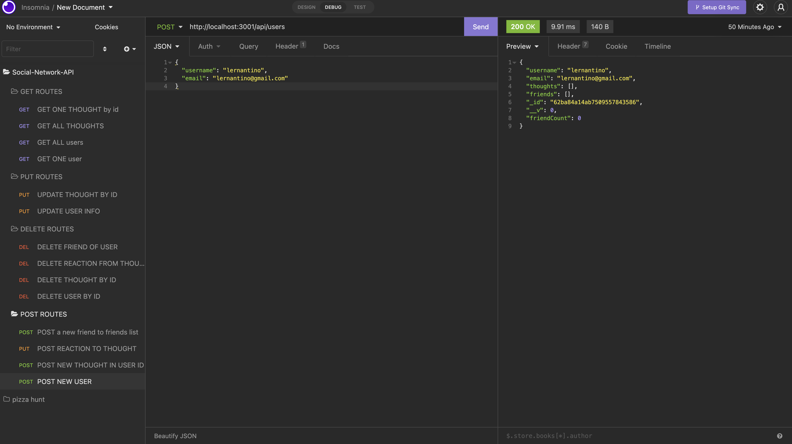
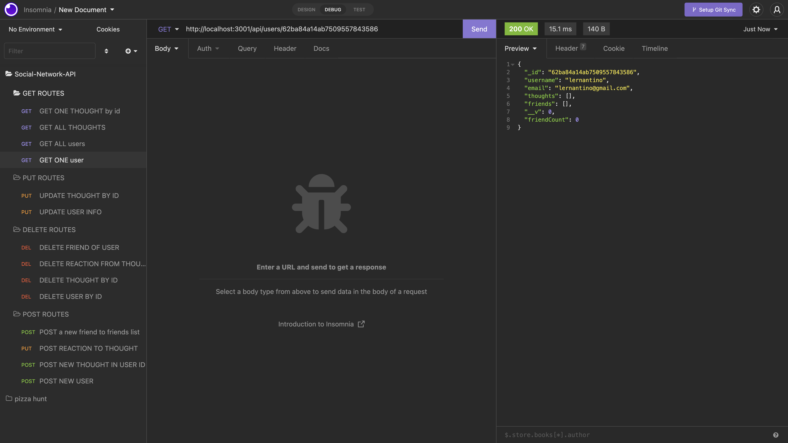
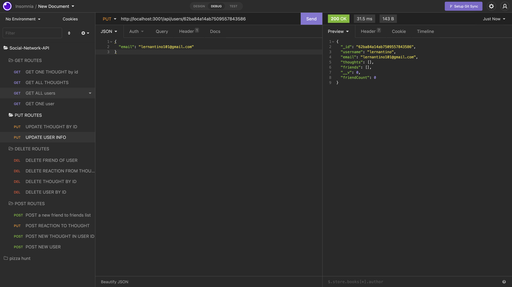

# Social-Network-API

## Purpose
In this project we are building the back end routes using a NoSql database. We will retrieve user, thought, and reaction data from the mongoDB database. The routes are for creating, updating, finding all or one, and deleting users and thoughts. There are also routes for creating and deleting a users friend and thought reactions. the following images are only for User routes and the video will include the rest of the routes for the friends, thoughts, and reactions. 

## Built With 
* Javascript
* Express.js
* MongoDB
* Mongoose

## GitHub Link
https://github.com/Itzamary/Social-Network-API

## Video Recording
* Recording 1 https://drive.google.com/file/d/1QwPzmIcmIYNUdHlP1AMH4gRC_4Xn3gVS/view

* Recording 2 https://drive.google.com/file/d/1Px89iBCmVqqkolAhy7xl8Ut9UgT7cNdO/view

## Images

